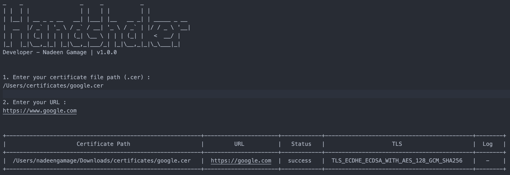

# Handshaker

Handshaker is a SSL Checker to help you quickly diagnose problems with your SSL certificate installation. You can verify the SSL certificate on your web server to make sure it is correctly installed, valid, trusted and doesn't give any errors to any of your users.

# New Features!

  - Check the SSL certificate validation status.

## Installation

Step-1: The tool relies on Java, so make sure you have installed the Java and running in your local environment.

Step-2: Copy handshaker.sh to a directory where you want to maintain Identity Server git repositories. Alway better to keep this readonly.

```markdown
$ wget https://github.com/nadeengamage/handshaker/raw/master/handshaker.sh
$ chmod +x handshaker.sh
```

Also please make sure that you have Internet access, while running the tool.

## Usage 

While executing the following command, provide the required details which appear on the terminal. 

```markdown
$ sh handshaker.sh
```
The result should be like the following.



## License

This project is licensed under the Apache-2.0 License - see the LICENSE file for details.